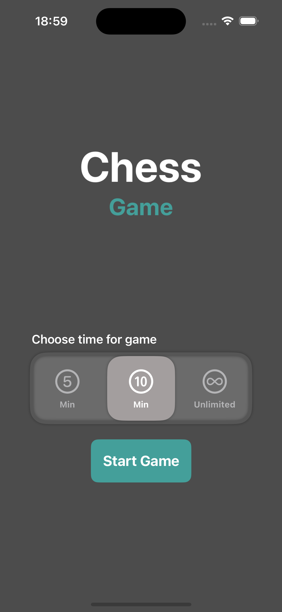
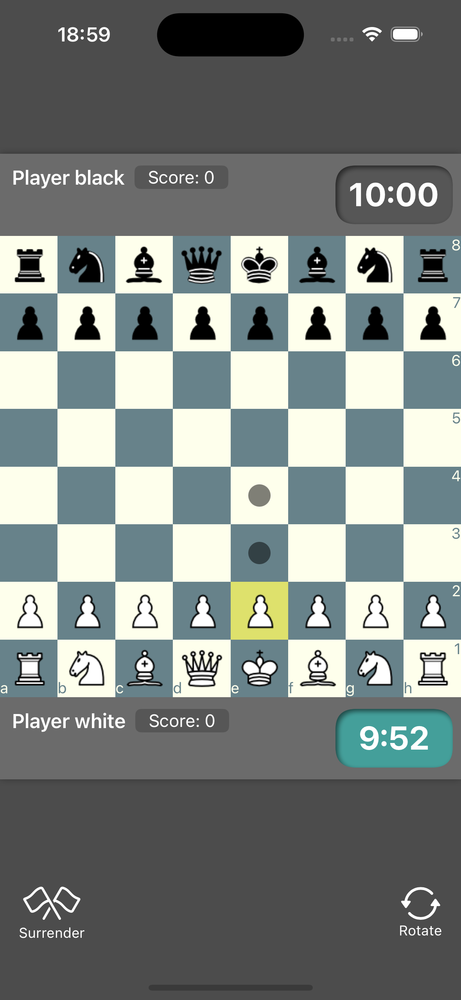
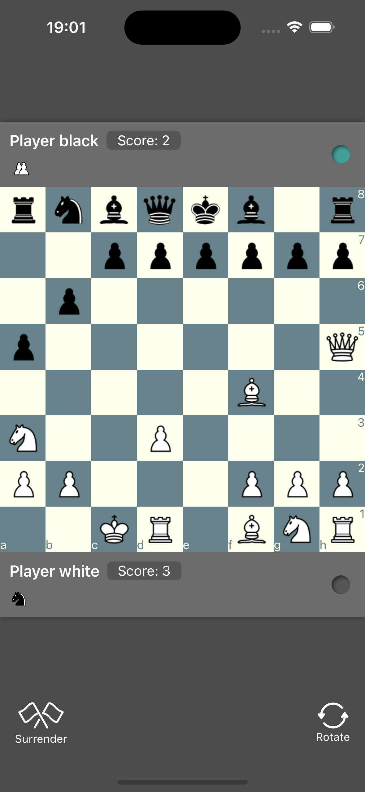

# ChessGame
A two-player local chess game built with SwiftUI using the MVVM architecture.

# Screenshots
  

# Video
<video width="200" height="200" src="https://github.com/user-attachments/assets/16794a1f-3f28-4dc4-b148-603b06a9a1d1"></video>

